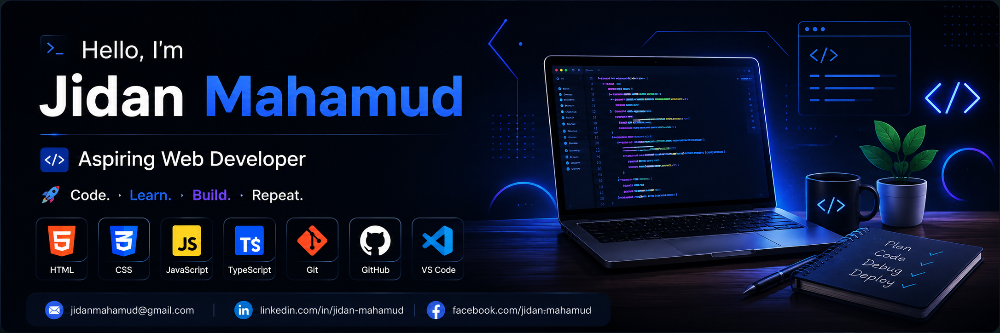

  

<h1 align="center">Hi, I'm Jidan Mahamud 👋</h1>

<h3 align="center">Aspiring Web Developer 💻</h3>

## 👨‍💻 About Me

I am an aspiring Web Developer who is passionate about learning and building websites.
I am currently learning JavaScript and TypeScript and improving my problem-solving skills.

- 🌱 Currently learning JavaScript & TypeScript
- 💻 Practicing web development every day
- 🚀 Building small projects to improve my skills
- 🎯 My goal is to become a professional Web Developer

## 🛠️ Skills

  
  
  
  
  
  
  

## 🌐 Connect With Me

  

  

## 📊 GitHub Stats

  

  

